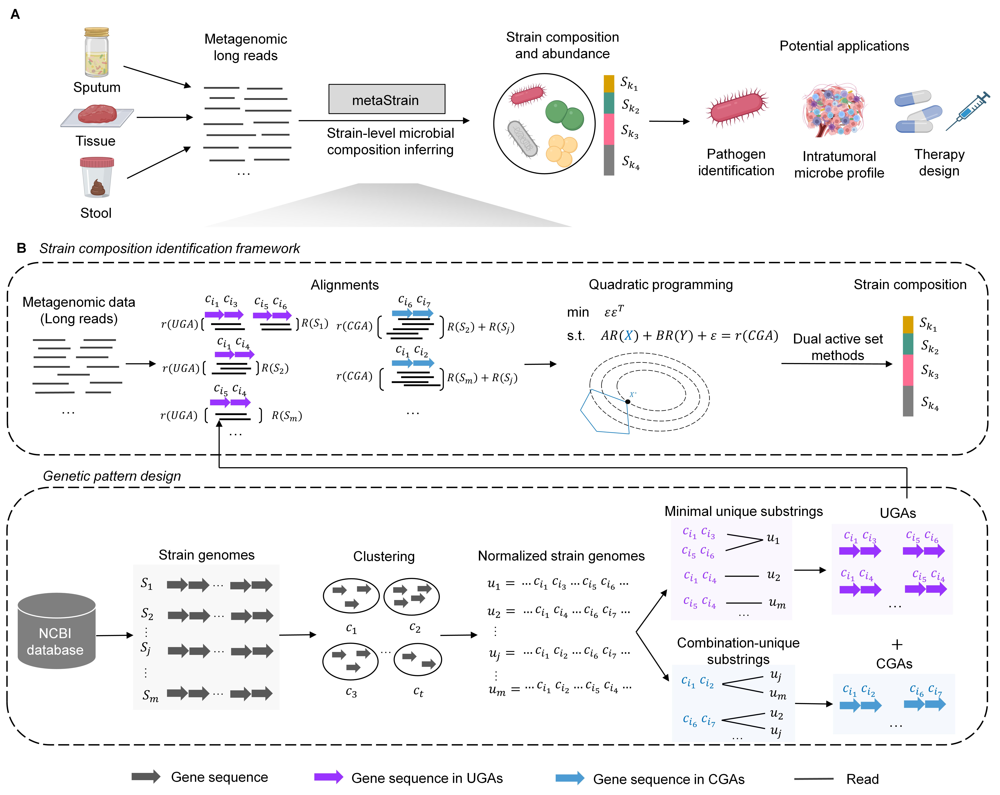

# metaStrain
## Brief description:
metaStrain is a method for determining the strain composition of microbial communities based on metagenomic sequencing data.


## Environment:
metaStrain is an integrated C++ package that requires a basic **UNIX/Linux environment**. The GCC compiler is required to be installed prior (we have tested successfully on version 8.4.0 and version 11.4.0). More details can be found [here](https://gcc.gnu.org/). Currently, metaStrain does not support Mac or Windows systems. The computational tools required in this pipeline also include [Kraken2](https://github.com/DerrickWood/kraken2), [minimap2](https://github.com/lh3/minimap2), and [vsearch](https://github.com/torognes/vsearch). 
| Tool | Purpose| Installation |
|------|---------|-------------|
| [Kraken2](https://github.com/DerrickWood/kraken2) | Species composition profiling | Required |
| [minimap2](https://github.com/lh3/minimap2) | Sequence alignment | Required |
| [vsearch](https://github.com/torognes/vsearch) | Microbiome sequence processing | Required |
## Usage: 
### 1. Installation
The source code of metaStrain is freely available at <https://github.com/wqlyt17/metaStrain.git>.  
To install metaStrain, download the zip file manually from GitHub or use the code below in Unix:

```bash
cd /your_path/
git clone https://github.com/wqlyt17/metaStrain.git
```
### 2. Quick start (Example) 
If the required tools, including minimap2 and vsearch, are installed, you can run the commands below to perform strain identification. Detailed usage instructions are provided in the Detailed pipeline of metaStrain section below.

Download [reference file 1](https://drive.google.com/file/d/1VBtQBlaQMEW-XqOHXjid9IqZ-sNjdTPG/view?usp=drive_link) and [reference file 2](https://drive.google.com/file/d/1MY_e0H5ePxnBwlNpkj9eUI8nnAaF-oKG/view?usp=drive_link) to the reference folder (metaStrain/reference), and download [metagenomic sample](https://drive.google.com/file/d/1e2zYPeqPWmPs9ZJPE9O8m-KuDvfXT1_z/view?usp=drive_link) to the data folder (metaStrain/data).
```bash
cd metaStrain
mkdir patterns
mkdir run
path="/your_path/metaStrain"
bash pattern_construction.sh species_pattern.txt ${path}/reference ${path}/code/patterns ${path}/patterns
bash strain_identify.sh ${path}/code ${path}/meta_sample.report ${path}/data/B1.fastq ${path}/patterns/ 1 ${path}/run 
```

### 3. Detailed pipeline of metaStrain
First create a folder named "patterns" and a folder named "run":

```bash
cd metaStrain
mkdir patterns
mkdir run
```

#### 3.1 Pattern construction
Download [reference file 1](https://drive.google.com/file/d/1VBtQBlaQMEW-XqOHXjid9IqZ-sNjdTPG/view?usp=drive_link) and [reference file 2](https://drive.google.com/file/d/1MY_e0H5ePxnBwlNpkj9eUI8nnAaF-oKG/view?usp=drive_link) to the reference folder, and download [metagenomic sample](https://drive.google.com/file/d/1e2zYPeqPWmPs9ZJPE9O8m-KuDvfXT1_z/view?usp=drive_link) to the data folder.
```bash
cd metaStrain
```
Installing minimap2:
```bash
curl -L https://github.com/lh3/minimap2/releases/download/v2.30/minimap2-2.30_x64-linux.tar.bz2 | tar -jxvf -
./minimap2-2.30_x64-linux/minimap2
```
Add minimap2 to your PATH so it can be run from anywhere:

```bash
 export PATH=$PATH:/your_path/metaStrain/minimap2-2.30_x64-linux
```
**Note:** minimap2 is a versatile pairwise aligner for genomic and spliced nucleotide sequences and can be installed from its GitHub repository (https://github.com/lh3/minimap2). 

Installing vsearch:
```bash
conda install bioconda::vsearch
```
**Note:** vsearch is a versatile open-source tool for microbiome analysis and can be installed from its GitHub repository (https://github.com/torognes/vsearch). 

Constructing patterns:
```bash
path="/your_path/metaStrain"
bash pattern_construction.sh species_pattern.txt ${path}/reference ${path}/code/patterns ${path}/patterns
```
**Note 1:** `species_pattern.txt` contains the names of the species for which patterns will be constructed. Each row corresponds to a species, and spaces in species names should be replaced by underscores. For additional details, please refer to the example species_pattern.txt file provided in the metaStrain folder.

Example:
```text
Bacteroides_fragilis
```
**Note 2:** ${path}/reference is the directory storing the genome references used for pattern construction. For each species, two files are required: a CDS reference (`species_cds.fa`) and a genome reference (`species.fa`). Users can provide CDS and genome references for specified strains according to their needs to construct their own patterns. A bash script is provided to download the reference files for the specified species from NCBI, as described below. 
  ```bash
bash download_reference.sh species_pattern.txt /your_path/metaStrain/code  /your_path/metaStrain/reference/
```

**Note 3:** ${path}/code/patterns contains the code used to construct patterns. ${path}/patterns is the directory where the resulting patterns are stored. After constructing patterns, this directory contains the pattern files `UP.fa` and `Com.fa`, where `UP.fa` includes the constructed UGAs and `Com.fa` includes the constructed CGAs. All other files in ${path}/patterns are required for the quadratic programming model of metaStrain. The `UP.fa` and `Com.fa` files are provided in standard FASTA format, where each header corresponds to a single constructed pattern.

For example, 
```text
>NC_006347.1_1
TCAGTCGTTTTCTTTTTCCACATCATGCCTTTGAGTTATTAAGCGGTATTGTTCGTCACTTCGAAAGCGGATGGCGTTTTCGTACCAGACATCATTGGCGGCCTGATACGCTTGTACACCGTTTATACGGTCTTCATCTATCAGTCGGGCAATAATGGCGGAACCTCTATAGGCGGTATCCCAGAACAAAGCTAAATCACCGATCCTGGGAGTCTGCTCTATATGGTCCGTTTCCTGACAGAAGAAATCTGAAAGATTCTCCGGTTCAAATGTGATTATTAACCTATTGTCTACAGCCTCAACAGAAGCATGGCGACATTCGGGGGGAATACTAAAGTTTTGTATCTTCATTTAATAGGCGATTGAATCATAGAACTGCCGATTACGCAAATACTCCTTTACCACATCCGATGAAGTGGCACGATCACCGATACGATCATGGATGTACTGGTACTTCTCAAAACTCATACCTGAGAGGATATCATCATTCATCTCTACGTTGCCGGCATAGATGCAACCGGCAACCGTAACTATGCTTATGATGACCGTAAACAGATGCTTGGAAAGACTATTCATGTTCTTCAT
>NC_006347.1_2
ATGAAAGAGTTATTTAATACCAAAGTAACCGTAAGGCTTCGTAAAGTCGAAAACCGTAAGGAATGGTATGTTTATATCGAAAGCTATCCCGTATTTGTTCCCGGTAAGAAAGTCCCACAACGCATACGCGAATACCTGAACCGCAGTGTTACCACAGTGGAATGGGATAAGAAACGAGTCGCCCGCACCGAAGCAGACGGAACGAAAACCTATAAACCCAAGTGTGATGATAACGGAATCATTGTTTGCCGAAGTGAAAAAGACCAAGAAAGTATGTTATATGCCGACGGCGTTCGCAAATTACGACAACGCGAATACGATAACGTCGATTTGTATAGCGAAACGGAGACTGCCCAAGCAGAACAAAGAGAACGCTCACAGCAGAATTTCATTGAGTACTTTGATGTCGTATCGAAAAAACGTCATGCTAACAGTTCGGAATCTATTATTGTGAATTGGCGGCGGACACACGAATTACTAAAGATTTTTGCGGGTGAGTATCTGCCATTTTC
```

#### 3.2 Run Kraken2 to acquire the species composition of a given metagenomic sample
```bash
cd metaStrain
```
Installing Kraken2 and constructing its database:
```bash
conda install bioconda::kraken2
kraken2-build --download-taxonomy --db /your_path/kraken/database
kraken2-build --download-library bacteria --threads 24 --db /your_path/kraken/database
kraken2-build --build --threads 24 --db /your_path/kraken/database
```
**Note:** Kraken2 can be installed from its GitHub repository (https://github.com/DerrickWood/kraken2). For detailed configuration instructions, please refer to the official [Kraken2 GitHub repository](https://github.com/DerrickWood/kraken2).

Obtaining the species composition:
```bash
path="/your_path/metaStrain"
kraken2 --db /your_path/kraken/database ${path}/data/B1.fastq --threads 20 --use-mpa-style --report ${path}/meta_sample.report --output ${path}/meta_sample.txt
```

**Note 1:** /your_path/kraken/database specifies the directory containing the Kraken2 database, while ${path}/data/B1.fastq specifies the path to the input metagenomic sample (here, B1.fastq is used as an example).

**Note 2:** If strain identification is required only for a specific species, this step can be skipped. Simply replace Bacteroides fragilis with the target species name in the meta_sample.report file.
#### 3.3 Strain identification of a given metagenomic sample
```bash
cd metaStrain
bash strain_identify.sh ${path}/code ${path}/meta_sample.report ${path}/data/B1.fastq ${path}/patterns/ s ${path}/run  
```
**Note 1:** ${path}/code contains the codes used for strain identification. ${path}/meta_sample.report is the output file generated by Kraken2. ${path}/data/metagenome_filename is the input metagenomic sample (e.g., B1.fastq). ${path}/patterns/ is the directory where the constructed patterns are stored.

**Note 2:** "s" denotes the species with the top "s" abundance according to Kraken2 (e.g., "1" indicates identifying strains from one species). Users can specify "s" to extract the top "s" most abundant species as needed.

**Note 3:** ${path}/run is the directory for output files. `output_sort.txt` contains the strain identification results for the given metagenomic sample. The first column lists the strain genome names, and the second column reports the corresponding abundance of each strain genome.
## Contact 
Any questions, problems, or bugs are welcome and should be reported to [Bingqiang Liu](bingqiang@sdu.edu.cn) or [Qi Wang](wangqi1994_sdu@163.com).

